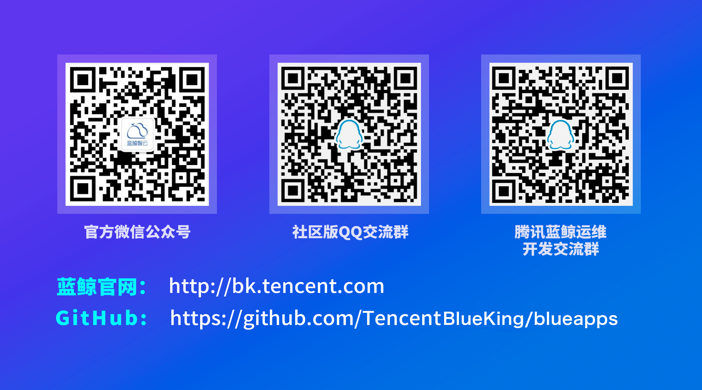

# django-versionlog


[](https://github.com/TencentBlueKing/django-versionlog/blob/master/LICENSE) [](https://github.com/TencentBlueKing/django-versionlog/releases) [](https://github.com/TencentBlueKing/django-versionlog/pulls) 

> **重要提示**: `master` 分支是开发分支，可能处于 *不稳定或者不可用状态* 。请通过[releases](https://github.com/TencentBlueKing/django-versionlog/releases) 而非 `master` 去获取稳定的软件包

django-versionlog是为网站开发者提供版本日志快速接入的功能模块，支持django框架，兼容python2和python3。开发者只需在项目中进行简单的配置和维护版本日志目录中的md文件，即可在项目中向用户展示网站版本的更新迭代内容。

## Overview

- [最新特性](docs/feature.md)
- [代码目录](docs/structure.md)
- [进阶使用](docs/usage.md)

## Quick Start

本节以单页面对话框版本日志为例，展示使用本功能模块最简单的流程：
1. 安装版本日志功能模块(内部仓库)：
    ``` shell
    pip install django-versionlog 
    ```

2. 在项目配置文件中的INSTALLED_APPS内添加version_log：
    ``` python
    INSTALLED_APPS += (
        'version_log'
    )
    ```

3. 在项目的urls.py中配置路由：
    ```python
    import version_log.config as config
    urlpatterns = [
        ...,
        url(r'^{}'.format(config.ENTRANCE_URL), include('version_log.urls', namespace='version_log')),
    ]
    ```

4. 创建和初始化对应表：
    ```shell
    python manage.py makemigrations version_log
    python manage.py migrate
    ```

5. 收集静态文件&启动项目：
    ```shell
    python manage.py collectstatic
    python manage.py runserver
    ```

    项目运行后，会在项目根目录下创建版本日志文件目录version_logs_md，该目录用于存放开发者网站版本日志文件。

    __注意__： 这里假设项目配置变量中BASE_DIR指向工程根目录。

6. 添加版本日志文件：

    每个版本的日志对应于一个md文件，同时md文件命名需与版本号对应。
    命名格式可为 `版本号_版本日期.md` 或 `版本号.md`。前者会以文件名中的日期作为版本日期，后者会以文件最新修改日期作为版本日期。
    
    建议版本号的规则满足正则：```[vV](\d+\.){2,4}md```， 如：v1.1.md, V1.2.3.md等，命名风格最好统一。
    版本文件命名中的日期格式可通过FILE_TIME_FORMAT进行配置，默认为`%Y%m%d`，如20201104等。

    开发者需将准备好的版本日志文件都放到version_logs_md文件夹中，1.3.0之后版本模块不再对文件名进行强制校验，所以开发者需保证放入文件夹中的文件都是符合命名规范且可解析的版本日志文件。

7. 重启项目：

    ```shell
    python manage.py runserver
    ```

8. 查看效果：打开链接 `{SITE_URL}/version_log/` 即可查看效果，其中{SITE_URL}为开发者网站地址。


## Support

- [蓝鲸论坛](https://bk.tencent.com/s-mart/community)

- 联系我们，技术交流QQ群：

  社区版QQ交流群：495299374
  
  蓝鲸运维开发交流群：878501914
  
  
## BlueKing Community

- [BK-CMDB](https://github.com/Tencent/bk-cmdb): 蓝鲸配置平台（蓝鲸 CMDB）是一个面向资产及应用的企业级配置管理平台。
- [BK-CI](https://github.com/Tencent/bk-ci): 蓝鲸持续集成平台是一个开源的持续集成和持续交付系统，可以轻松将你的研发流程呈现到你面前。
- [BK-BCS](https://github.com/Tencent/bk-bcs): 蓝鲸容器管理平台是以容器技术为基础，为微服务业务提供编排管理的基础服务平台。
- [BK-PaaS](https://github.com/Tencent/bk-PaaS): 蓝鲸 PaaS 平台是一个开放式的开发平台，让开发者可以方便快捷地创建、开发、部署和管理 SaaS 应用。
- [BK-SOPS](https://github.com/Tencent/bk-sops): 标准运维（SOPS）是通过可视化的图形界面进行任务流程编排和执行的系统，是蓝鲸体系中一款轻量级的调度编排类 SaaS 产品。
- [BK-JOB](https://github.com/Tencent/bk-job): 蓝鲸作业平台(Job)是一套运维脚本管理系统，具备海量任务并发处理能力。

## Contributing

对于项目感兴趣，想一起贡献并完善项目请参阅[Contributing Guide](docs/contributing.md)。

[腾讯开源激励计划](https://opensource.tencent.com/contribution) 鼓励开发者的参与和贡献，期待你的加入。

## License

基于 MIT 协议， 详细请参考[LICENSE](LICENSE)
